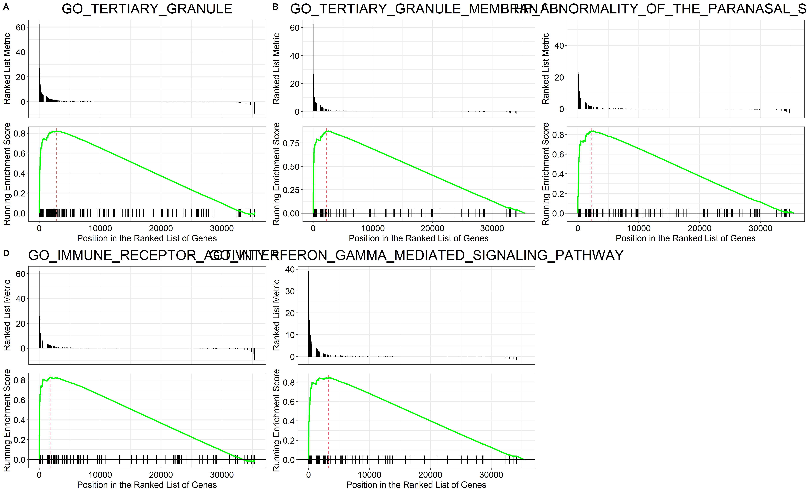
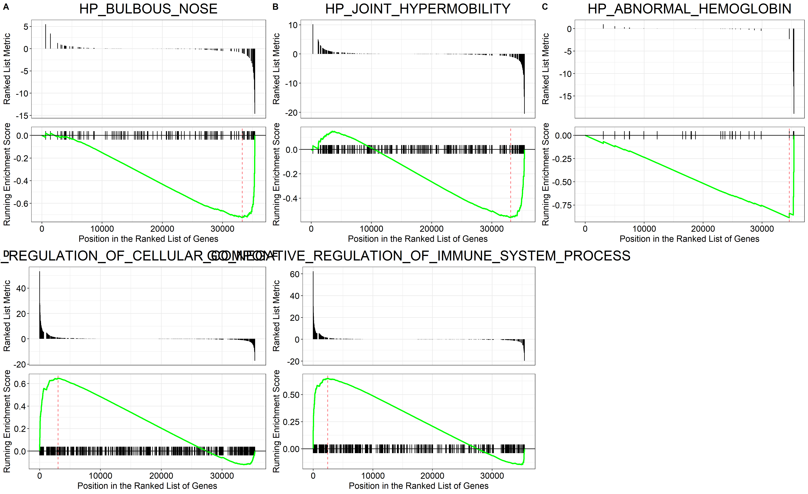

```{r setup, include=FALSE}
knitr::opts_chunk$set(echo = FALSE)
knitr::opts_chunk$set(message = FALSE)
knitr::opts_chunk$set(warning = FALSE)
```

```{r}
# Load libraries

#suppressMessages(library(recount))
suppressMessages(library(DT))
suppressMessages(library(DESeq2))
suppressMessages(library(tidyverse))
suppressMessages(library(AnnotationDbi))
suppressMessages(library(EnsDb.Hsapiens.v86))
suppressMessages(library(PoiClaClu))
suppressMessages(library(pheatmap))
suppressMessages(library(RColorBrewer))
suppressMessages(library(EnhancedVolcano))
suppressMessages(library(msigdbr))
suppressMessages(library(clusterProfiler))
suppressMessages(library(ggpubr))
```

## 0) Load and prepare data

### 0.1) Data overview

The data used in this RNA-Seq analysis was originally generated in [this study](https://www.ncbi.nlm.nih.gov/bioproject/PRJNA275655) and the results discussed in [this paper](https://doi.org/10.1016/j.stemcr.2015.04.012). The six generated runs can be found [here](https://www.ncbi.nlm.nih.gov/Traces/study/?acc=PRJNA275655&o=acc_s%3Aa).\

The biological question was to clarify the lineage relationship between IL3Rαhigh- and IL3Rαlow precursor cells and to find potential molecules involved in their differentiation. Therefore, cells were obtained from three independent donors and subsequently mRNA deep sequencing was applied to generate the data.

### 0.2) First look at data

The data was downloaded via R package `recount` with accession number `SRP055103`. **Table 1** shows the downloaded metadata for study `SRP055103`.

```{r}
dat <- read.csv('SRP055103.txt', header = TRUE, sep = ",")

datatable(dat, options=list(scrollX = TRUE, scrollY = TRUE), caption = 'Table 1: Data', class = 'cell-border stripe')
```

We created an additional column 'condition' in our data for later creation of design matrix used for differential expression analysis. The two levels in 'condition' are 'high' and 'low' based on column 'cell_population' from data table above.

```{r}
# url <- download_study('SRP055103')

load(file.path('SRP055103', 'rse_gene.Rdata'))

rse_gene$condition <- factor(c("low", "low", "low", "high", "high", "high"), levels = c("high","low")) %>% relevel(.$condition, ref = "low")

## Create DESeq data set, using paired design
dds <- DESeqDataSet(rse_gene, design = ~ condition)
```

## 1) Exploratory analyis and visualization

### 1.1) Create a PCA plot colored by the condition of interest

A variance-stabilizing transform was applied to the counts and a principal component analysis (PCA) was implemented to visualize sample-level differences.

```{r}
## Perform regularized-logarithm transformation (rlog) on the data
rld <- rlog(dds)

plotPCA(rld, intgroup = c("condition", "title"))
```

### 1.2) Heatmap of Poisson distances between samples

To confirm the results of our PCA analysis, we additionally calculated the sample-level distance with hierarchical clustering.

```{r}
poisd <- PoissonDistance(t(counts(dds)))
samplePoisDistMatrix <- as.matrix( poisd$dd )
rownames(samplePoisDistMatrix) <- paste( dds$condition, dds$title, sep=" - " )
colnames(samplePoisDistMatrix) <- NULL
colors <- colorRampPalette( rev(brewer.pal(9, "Blues")) )(255)
annotation <- as.data.frame(colData(rld)[, "condition"])
rownames(annotation) <- paste( dds$condition, dds$title, sep=" - " )
colnames(annotation) <- "condition"
pheatmap(samplePoisDistMatrix,
         clustering_distance_rows = poisd$dd,
         clustering_distance_cols = poisd$dd,
         annotation_row = annotation,
         col = colors)
```

The high degree of separation between biological conditions and close clustering of replicates for both PCA and Heatmap were an encouraging sign of high data quality and strongly detectable biological differences. 

## 2) Differential expression analysis

### 2.1) Calculation of DEGs using <code>DESeq2</code>

Differentially-expressed genes (DEGs) were calculated using the R package `DESeq2` with default settings. The used design matrix in this analysis was the comparison of the two levels of condition, high and low.\

Additionally, we used a shrinkage method on the raw data counts to shrink the log2 fold changes for the comparison of condition high vs low samples. The results of this analysis revealed 1363 significant DEGs (see **Table 2**).\

A DEG was classified as significant when it showed an adjusted p-value smaller 0.01, a log2 fold change greater than or equal 1 and a base mean greater than or equal 20.

```{r}
dds <- DESeq(dds)

res <- results(dds)

resNorm <- lfcShrink(dds = dds, res = res, type = "normal", coef = 2)

# Make a DF
resdf <- as.data.frame(resNorm)

# convert ENSG to gene symbol
ens2sym <- AnnotationDbi::select(EnsDb.Hsapiens.v86, keys = keys(EnsDb.Hsapiens.v86),
                                 columns = "SYMBOL")

# wrangle the resdf and join with ens2sym map
resdf <- resdf %>%
  rownames_to_column() %>%
  mutate(GENEID = gsub(rowname, pattern = "\\..+", replacement = "")) %>%
  inner_join(y = ens2sym, by = "GENEID")

resdf <- column_to_rownames(resdf, var = "rowname")

over_expressed_genes <- resdf %>%
  dplyr::filter(padj < .01 & abs(log2FoldChange) >= 1 & baseMean >= 20)

## Ordered DEGs from strongest downregulation to upregulation
datatable(as.data.frame(over_expressed_genes[order(over_expressed_genes$log2FoldChange),]), options=list(scrollX = TRUE, scrollY = TRUE), caption = 'Table 2: Significant DEGs', class = 'cell-border stripe')
```

## 3) Plotting results

### 3.1) MA plot

We also had a look at relationship between intensity and difference between log fold change and mean of normalized counts for our two conditions high and low.

```{r}
plotMA(resNorm)
```

### 3.2) Create a Volcano Plot

The correlation of effect size (`Log2 fold change`) and significance (`-Log10P`) show a number of significant DEGs.

```{r, fig.height=8.5, fig.width=7.5}
EnhancedVolcano(resdf, 
                lab = resdf$SYMBOL, 
                pCutoff = 1e-100, #0.01
                FCcutoff = 3,
                x = "log2FoldChange", 
                y = "padj",
                title = "ILRa3-low versus ILRa3-high")
```

## 4) Heatmap showing the top 20 over- and under-expressed DEGs

The top 20 DEGs were strongly divergent between biological conditions high and low.

```{r}
# Prepare matrix for heatmap
mat <- assay(rld)
ordered_over_expressed_genes <- over_expressed_genes[order(over_expressed_genes$padj), ]
id1 <- rownames(ordered_over_expressed_genes)
id2 <- ordered_over_expressed_genes$SYMBOL
DE <- mat[id1,]
rownames(DE) <- id2

# Plot heatmap of top 20 DEGs
top20DE <- head(DE, n=20)
DEgenesTop <- mat[top20DE,]
annotation <- as.data.frame(colData(rld)[, c("condition","title")])
pheatmap(top20DE, scale = "row", clustering_distance_rows = "correlation", annotation_col = annotation, main="Top 20 DEGs")
```

Taken together, these results indicate powerful biological differences between high and low conditions.

## 5) Top 5 pathways of GSEA of DEGs

Gene set enrichment analysis (GSEA) was performed with `-log10(FDR)*sign(log2FoldChange)` as the ranking metric and using all available gene set annotations from MSIGDB.

```{r}
# Get the gene sets and wrangle
gene_sets <- msigdbr(species = "Homo sapiens", category = "C5")
gene_sets <- gene_sets %>%
  dplyr::select(gs_name, gene_symbol)

# Adding a score for GSEA
resdf2 <- resdf %>%
  arrange(padj) %>%
  # Deal with inf
  mutate(padj = case_when(padj == 0 ~ .Machine$double.xmin, TRUE ~ padj)) %>%
  mutate(gsea_metric = -log10(padj) * sign(log2FoldChange)) %>%
  # Remove NAs and order by GSEA
  filter(! is.na(gsea_metric)) %>%
  arrange(desc(gsea_metric))

# Get the ranked GSEA vector
ranks <- resdf2 %>%
  select(SYMBOL, gsea_metric) %>%
  distinct(SYMBOL, .keep_all = TRUE) %>%
  deframe()
```

The histogram below shows the calculated GSEA metric for our data.

```{r}
# GSEA value histogram
hist(resdf2$gsea_metric, breaks = 100, xlab = "Calculated GSEA metric", main = "Histogram of GSEA metric")
```

```{r}
# Run GSEA
gseares <- GSEA(geneList = ranks, 
                TERM2GENE = gene_sets)
gsearesdf <- as.data.frame(gseares)
```

```{r}
# Get top 5 over-expressed pathways
top_pathways <- gsearesdf %>%
  top_n(n = 5, wt = NES) %>%
  pull(ID)

# Make gseaplot for each and return as list
top_pathway_plots <- lapply(top_pathways, function(pathway) {
  gseaplot(gseares, geneSetID = pathway, title = pathway)
})

# Arrange with labels as a multi-panel plot
top_pathway_plot <- ggarrange(plotlist = top_pathway_plots,
                              ncol = 3, nrow = 2, labels = "AUTO")

ggsave(top_pathway_plot, filename = "top_GSEA_up.png",
       height = 11, width = 18)
```

The plot below shows the top 5 over-expressed pathways for our GSEA.

```{r out.width='100%'}

```

```{r}
# Repeat steps with top 5 under-expressed pathways
bottom_pathways <- gsearesdf %>%
  top_n(n = 5, wt = -NES) %>%
  pull(ID)

bottom_pathway_plots <- lapply(bottom_pathways, function(pathway) {
  gseaplot(gseares, geneSetID = pathway, title = pathway)
})

bottom_pathway_plot <- ggarrange(plotlist = bottom_pathway_plots,
                                 ncol = 3, nrow = 2, labels = "AUTO")

ggsave(bottom_pathway_plot, filename = "top_GSEA_down.png",
       height = 11, width = 18)
```

The plot below shows the top 5 under-expressed pathways for our GSEA.

```{r out.width='100%'}

```

We found significant results for our GSEA based on an adjusted p-value smaller than or equal to 0.05 (see **Table 3**).

```{r}
sig_gsearesdf <- gsearesdf %>%
  filter(p.adjust <= 0.05) %>%
  arrange(desc(NES)) %>%
  select(NES, pvalue, p.adjust, core_enrichment)

datatable(sig_gsearesdf, options=list(scrollX = TRUE, scrollY = TRUE), caption = 'Table 3: Significant GSEA', class = 'cell-border stripe')
```

## 6) Concluding questions

### 6.1) What does this finding imply about IL3R cells?

As stated at the beginning, the biological question of this study was to clarify the lineage relationship between IL3Rαhigh- and IL3Rαlow precursor cells and to find potential molecules involved in their differentiation.\

The [original paper](https://doi.org/10.1016/j.stemcr.2015.04.012) categorized the IL3Rαlow subset as common progenitor of granulocytes (GR), macrophages (MΦ), Osteoclasts (OC), and dendritic cells(DC) (**GMODP, common progenitor of GR, MΦ, OC, and DC**) and the IL3Rαhigh as common progenitor of MΦ, OC, and DC (**MODP, common progenitor of MΦ, OC, and DC**).\

OCs, MΦs, and DCs are closely related hematopoietic cell lines (blood cells).\

However, in cancer and autoimmune and inflammatory diseases, OCs can be promoted by tumors or immune cells, which facilitates bone metastasis, pathological bone loss, and remodeling.\

According to the original paper, a ingenuity pathway analysis (IPA) of DEGs indicated a further commitment to MΦ/OC/DC differentiation in the transition from the IL3Rαlow to the IL3Rαhigh phenotype. Additionally, the IL3Rαhigh subset showed higher mRNA expression of transcription factors important for pDC, cDC, and MΦ development.\

This RNA-Seq analysis was able to reproduce results from the original study.\

### 6.2) What does this tell us about development of the immune system?

Hematopoietic cells play an important role in the immune systems. The results from the  original study showed that the IL3Rα expression level discriminates two successive stages in commitment toward the OC, MΦ, and DC fate.\

The concentration of certain factors (in our example IL3Rαlow and IL3Rαhigh) contribute to the explained differentiation of pluripotent progenitor cells.

### 6.3) Why does this matter within the context of the developmental biology field?

Understanding the development of OC, DC, and MΦ is important for clinical diagnostics, targeted drug-based therapy, and cellular therapy.